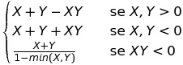

# SEAR - Sistema Esperto per l'Anamnesi del Ritardo nello sviluppo del bambino

## Introduzione e a chi è destinato

**SEAR** è un sistema esperto pensato per assistere logopedisti nell'attività di anamnesi del ritardo nello sviluppo del bambino fino ad età preadolescenziale sviluppato come caso di studio per il corso di Ingegneria della Conoscenza e Sistemi Esperti.

Le domande poste dal sistema sono le domande che il logopedista pone o ha posto ai genitori del paziente e le risposte accettate sono quelle che gli stessi hanno dato al medico.

L'output del sistema è **un'affermazione** circa il disturbo o ritardo trovato, se ne è stato trovato uno, e una serie di test e visite specialistiche consigliate per completare la visita.

## Metriche usate

In SEAR, ogni fatto asserito è una tripla **OAV** (Oggetto, Attributo, Valore) alla quale è associato un **CF** (Certainty Factor), ovvero un valore decimale tra **-1.0** e **+1.0**.

Se in un qualsiasi momento sono presenti due OAV identici, ma con CF diversi, la regola **combina-certainty-factor** li unisce in un unico fatto con un nuovo CF calcolato secondo la formula del sistema esperto MYCIN:

## Formato Regole

Esistono due tipi di regole in SEAR:

 - domande
 - inferenze

### Domande

Sono regole che prevedono interazione con l'utente dal quale acquisiscono una risposta che viene asserita nella WM. La risposta viene tradotta in un oav con uno specifico CF che può attivare una o più inferenze. Queste regole sono attivate solo se il fatto **(anamnesi (stato start))** è presente nella WM.

### Inferenze

Sono regole che non prevedono interazione con l'utente e si attivano quando da determinate domande vengono asseriti specifici fatti in memoria. L'output di ogni inferenza è un oav di diagnosi, test o visita consigliati.

## Domande degne di nota

### starting-rule

È sempre la prima regola ad essere attivata. Mostra un messaggio di introduzione, asserisce il fatto (anamnesi (stato start)) e imposta a TRUE la possibilità di avere fatti duplicati (necessario per la combinazione di CF secondo le regole di MYCIN).

### motivo, familiarità e diagnosi-precedente

Sono le successive prime regole ad essere attivate e l'unica forma di determinismo del sistema, utilizzate per ripercorrere l'ordine tipico di una anamnesi logopedica.

### chiedi-di-fermarsi

Ultima regola, permette di continuare o ripetere l'inferenza o di uscire dal programma.

## Inferenze degne di nota

### Inferenze di categoria

Ogni domanda appartiene a una macrocategoria definita generalmente dal valore nel campo object dell'OAV associato.

Le inferenze di categoria inferiscono un tipo di disturbo ogni volta che un nuovo oav viene asserito. OAV uguali vengono poi combinati per la regola combina-certainty-factor citata in precedenza.

### Inferenze di test

In base ai disturbi asseriti, definiscono un oav per il test associato.

### Inferenze di visita

In base a specifici oav (es: disturbi di vista, problemi comportamentali), definiscono un oav per suggerire una visita specialistica.

### esito-diagnosi-certo/incerto

Sono regole che si attivano solo quando una diagnosi è stata trovata, o analogamente quando non ci sono le basi per un disturbo. Asseriscono il fatto (anamnesi (stato stop)) che impedisce a una domanda di attivarsi e spinge l'inferenza verso il termine.

### consiglia-test e consiglia-visita

Si attivano solo dopo le precedenti e sono le uniche inferenze attivabili dopo che (anamnesi (stato stop)) è stato asserito. Se ci sono le basi, stampano i test e le visite specialistiche consigliate.

## Ritrattazione

In ogni momento, mentre si risponde a una domanda, è possibile controllare lo stato della working memory ed eventualmente modificare i fatti asseriti.
